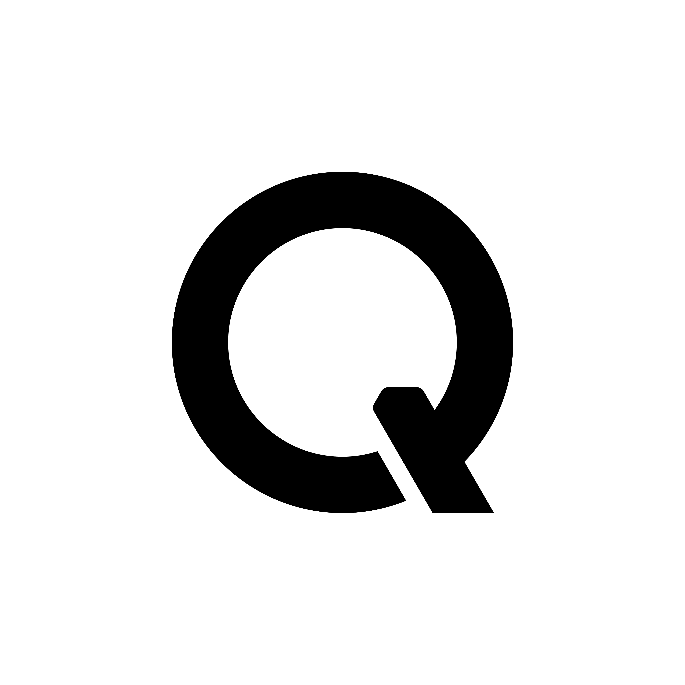

<p align="center">
  
</p>

<h1 align="center">Qwen Cloud AI Skills</h1>

<p align="center">
  将 Qwen Cloud 的全套 AI 技能折叠进你的 Agent 里，你提需求就行。
</p>

<p align="center">
  <a href="https://github.com/qwencloud/qwencloud-ai/blob/main/LICENSE"></a>
  <a href="https://github.com/qwencloud/qwencloud-ai/stargazers"></a>
  <a href="https://agentskills.io"></a>
  <a href="https://nodejs.org"></a>
</p>

<p align="center">
  <a href="./README.md">English</a>
</p>

---

## 亮点

- 🤖 **Agent 原生** — Agent 帮你选模型、调参数、处理报错，你只管说需求。
- ⚡ **一行安装** — 一条命令装完即用，零配置，无需对接 SDK。
- 🧠 **7 个技能，一个入口** — 文本、图像、视频、语音、视觉、模型选择、认证，全部内置。
- 🌐 **适配多种 Agent** — 可接入多种支持 [Agent Skills](https://agentskills.io) 的 Agent，即装即用。

<p align="center">
  <a href="https://claude.com/claude-code"></a>
  &nbsp;
  <a href="https://www.cursor.com"></a>
  &nbsp;
  <a href="https://github.com/google-gemini/gemini-cli"></a>
  &nbsp;
  <a href="https://chatgpt.com/codex"></a>
  &nbsp;
  <a href="https://cline.bot"></a>
  &nbsp;
  <a href="https://antigravity.google/"></a>
  &nbsp;
  <a href="https://sourcegraph.com/amp"></a>
  &nbsp;
  <a href="https://manus.im"></a>
  &nbsp;
  <a href="https://qwen.ai/qwencode"></a>
  &nbsp;
  <a href="https://qoder.com"></a>
  &nbsp;
  <a href="https://github.com/opencode-ai/opencode"></a>
  &nbsp;
  <a href="https://www.openclaw.ai"></a>
  &nbsp;
  <a href="https://roocode.com"></a>
  &nbsp;
  <a href="https://kilo.ai"></a>
  &nbsp;
  <a href="https://windsurf.com"></a>
  &nbsp;
  <a href="https://github.com/All-Hands-AI/OpenHands"></a>
  &nbsp;
  <a href="https://github.com/block/goose"></a>
  &nbsp;
  <a href="https://www.trae.ai"></a>
  &nbsp;
  <a href="https://kiro.dev"></a>
  &nbsp;
  <a href="https://devin.ai"></a>
  &nbsp;
  <a href="https://www.augmentcode.com"></a>
</p>

---

## 快速开始

### 手动安装

需要 Node.js 18+。

```bash
npx skills add qwencloud/qwencloud-ai
```

出现选择提示时，按 `a` 全选，回车确认。

### 让 Agent 来搞定（推荐）

把下面这段话丢给你的 AI Agent，让它全程搞定：

```
帮我安装 QwenCloud AI Skills：
1. 先检查 Node.js 有没有装好，没有就帮我装
2. 运行：npx skills add qwencloud/qwencloud-ai -y
3. 装好之后，先说一句"技能已装载"，然后告诉我获得了哪些技能，带我体验一下
```

装好之后，`qwencloud-ops-auth` 技能会自动引导你和 Agent 完成 API Key 配置。

---

## 能做什么

告诉 Agent 你要做什么——它负责写代码、选模型、调 QwenCloud 跑任务。

| 能力 | 试试这样说 |
|------|-----------|
| **文本批量处理** | "写个脚本，调 Qwen-Plus 把这一万份文档批量润色" · "用最便宜的文本模型，把这个文件夹里所有 PDF 逐篇总结" |
| **图片生成** | "帮我批量生成 20 张不同风格的产品海报，水墨、扁平、3D 各来几张" · "写个流程，把 /assets 里的图片统一加水印并扩展背景" |
| **视频生成** | "把这 5 张产品图，每张生成一段 5 秒的展示短视频" · "根据这段脚本和关键帧，生成一段电影感的开场视频" |
| **语音** | "把这本有声书的 30 个章节全部转成语音，用温暖女声" · "给这个播客列表里每一集生成中英双语的音频开场白" |
| **视觉理解** | "写个脚本，调 VL 模型把这个文件夹里的截图文字提取出来，记录到 Excel" · "批量分析这 200 张户型图，按房间逐一输出结构说明" |
| **模型选择** | "挑一个最省钱的模型来处理这批翻译" · "给这个问题选一个更强的推理模型" |

---

## 技能清单

| 技能 | 能力 |
|------|------|
| `qwencloud-text` | 文本生成、对话、写代码、推理、函数调用 |
| `qwencloud-vision` | 图片 / 视频理解、OCR、图表分析 |
| `qwencloud-image-generation` | 文生图、图片编辑、风格迁移 |
| `qwencloud-video-generation` | 文生视频、图生视频、视频编辑 |
| `qwencloud-audio-tts` | 文字转语音，多种音色可选 |
| `qwencloud-model-selector` | 根据场景推荐最合适的模型 |
| `qwencloud-ops-auth` | API Key 与认证管理 |

---

## 路线图

我们将持续扩展 Skills 能力体系，逐步覆盖 QwenCloud 平台的核心业务场景，确保 AI Agent 始终能以最自然、最高效的方式调用 QwenCloud 的全部能力。

| 分类 | 技能（规划中） | 能做什么 |
|------|--------------|---------|
| **账号** | `qwencloud-account` | 用量查询、免费额度查看、订阅查询、账单与计费查询 |
| **模型** | `qwencloud-model-manager` | 专属模型部署、版本管理与生命周期管理 |
| **开发** | `qwencloud-dev` | Prompt 调试与优化、API 调用示例生成 |
| **训练** | `qwencloud-finetune` | 数据集管理、微调任务创建与进度跟踪、结果评估 |
| **部署** | `qwencloud-deploy` | 自定义模型部署 |
| **可观测性** | `qwencloud-observe` | 模型效果评测、推理日志查询、调用异常诊断 |

随着 QwenCloud 平台能力的不断扩充，Skills 体系也将同步演进，持续降低 Agent 使用 QwenCloud 的门槛。

有想法？欢迎 [提 Issue](https://github.com/qwencloud/qwencloud-ai/issues)。

---

## 参与贡献

欢迎一起来建设！你可以通过以下方式参与：

- **反馈 Bug** — 遇到问题？[提 Issue](https://github.com/qwencloud/qwencloud-ai/issues) 并附上复现步骤。
- **提需求** — 对新技能或改进有想法？欢迎提 Feature Request。
- **提交 PR** — Fork 仓库，新建分支，改完后提 Pull Request。
- **完善文档** — 错别字、表述不清、更好的示例，统统欢迎。

---

> **免责声明** — 本技能会代你调用 QwenCloud API，产生的费用由你的账号承担。AI 生成的内容不保证完全准确，用于重要决策前请自行判断。请妥善保管 API Key。本项目仅供体验和参考，不提供任何可用性或稳定性保证。

## 许可证

[Apache 2.0](./LICENSE)
